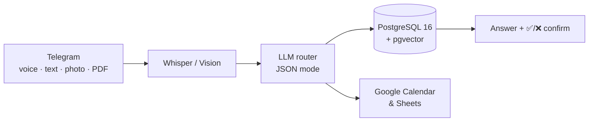
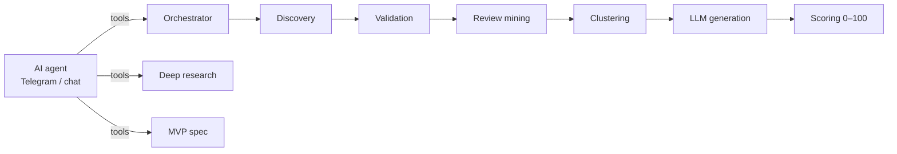
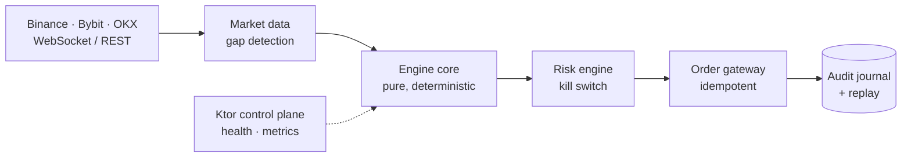
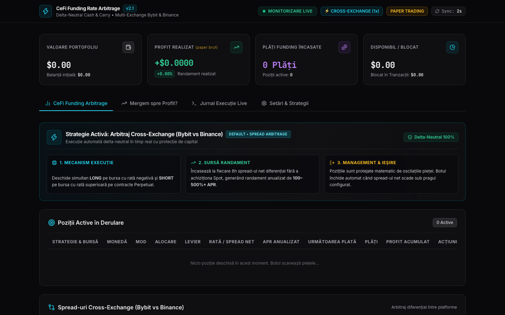

# Ion Bogdan — AI Automation Engineer

n8n · LLM integrations · Telegram & voice AI · TypeScript / Kotlin · Docker on VPS

Selected projects. I design the architecture and ship with AI coding agents (Claude Code, Codex, Antigravity) — I specify, review and deploy every system myself.

Source code is private — **walkthrough and code review available on request.**

📧 devionbogdan@gmail.com

---

## AI & n8n automation

### AI Biz Pilot — business assistant in Telegram
Voice, text, photo and document commands → structured records across 16 business modules.

- **n8n:** 64-node main workflow + cron workflow for proactive calendar alerts
- **No hallucinated numbers:** totals and reports computed in SQL; the LLM only parses language
- **RAG** over uploaded documents with pgvector; confirmation buttons before risky writes
- **Stack:** n8n, OpenAI, Whisper, PostgreSQL + pgvector, Docker, daily backups

### SaaS Opportunity Finder — market research pipeline
Mines real 1–3★ App Store reviews and Reddit, clusters complaints, scores product opportunities.

- **12 modular n8n workflows**, webhook API, central error logging
- Versioned prompt library (extraction → clustering → generation → scoring)
- **Stack:** n8n, OpenRouter LLMs, LangChain nodes, PostgreSQL, Telegram

### Orca Business OS — AI agents running a freelance business
Notion as the single source of truth, driven by specialised coding agents and n8n.

- Business agents (project manager, accountant) + dev agents (developer, reviewer, tester, designer)
- 14 slash commands — new client, new repo, daily plan, delivery
- n8n jobs on VPS: daily brief, invoice reminders, monthly reports
- **Stack:** Claude Code, OpenCode, Notion MCP, n8n, Telegram, Git worktrees

---

## Real-time systems

### Polymarket Liquidation Bot — TypeScript
Reads liquidation cascades and open interest on Binance, Bybit and OKX, trades Polymarket Up/Down markets.

- **Shadow / paper / live** modes; live orders signed with EIP-712
- **Risk:** cooldowns, hourly/daily limits, kill switch, calibration monitor
- **Tests + CI/CD:** GitHub Actions deploys to VPS (Docker Compose, Traefik) on every push
- Real-time web dashboard (SSE, TradingView charts), HMAC-signed webhooks to n8n

### HFT Multi-Exchange Platform — Kotlin / Ktor
Multi-module trading engine with deterministic replay and fail-closed risk.

- 11 Gradle modules; OKX is observation-only by design
- Contract tests on recorded exchange fixtures, scripted failure drills
- **Stack:** Kotlin, Ktor, Coroutines, PostgreSQL, Prometheus, Grafana, Docker

### Funding Rate Arbitrage Bot — TypeScript
Delta-neutral funding arbitrage scanner across Bybit, Binance, Bitget, Gate.io, OKX and Hyperliquid (read-only).

- 4 strategies + profitability guard that accounts for all four trade fees
- Margin health score with automatic unwind of both legs
- **Stack:** TypeScript, CCXT, Node.js HTTP server, Docker, GitHub Actions deploy

---

## Web

### Vista Guard — static site for Google Ads
22-page German site rebuilt from WordPress into a Python-generated static site. €0/month hosting.

- 4 conversion actions with values, Consent Mode v2, gclid/UTM attribution
- Ads-only landing pages (`noindex`), 6 local SEO pages, GDPR-safe self-hosted fonts
- **Stack:** Python build script, HTML/CSS/JS, Cloudflare Pages
