# Ion Bogdan — AI Automation Engineer

n8n · LLM & RAG · Voice AI (Retell) · TypeScript / Kotlin · Docker on VPS

Selected projects. I wrote Mine Maker by hand, without AI. The others I planned myself and built with AI coding tools, mostly Claude Code, then reviewed and deployed them myself.

Source code is private — **walkthrough and code review available on request.**

📧 devionbogdan@gmail.com

---

## AI & n8n automation

### AI Voice Receptionist — client project, in production
Real phone line for a VR entertainment venue, answered by an AI voice agent in Romanian and Russian. Call reports and bookings reach the team and the CRM automatically.

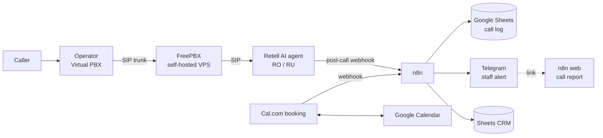

- **Conversation Flow agent** in two languages: explains services and collects name, preferences and desired date
- **3 n8n workflows:** post-call webhook → call log and Telegram alert; on-demand web call report; Cal.com bookings → CRM
- HTTPS on every admin panel; FreePBX and n8n run on the same VPS
- **Stack:** Retell AI, FreePBX, SIP trunk, n8n, Cal.com, Google Sheets & Calendar, Telegram

### AI Biz Pilot — business assistant in Telegram
Voice, text, photo and document commands → structured records across 16 business modules.

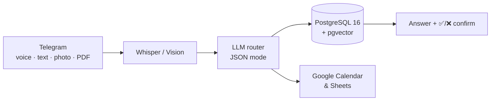

- **n8n:** 64-node main workflow + cron workflow for proactive calendar alerts
- **No hallucinated numbers:** totals and reports computed in SQL; the LLM only parses language
- **RAG** over uploaded documents with pgvector; confirmation buttons before risky writes
- **Stack:** n8n, OpenAI, Whisper, PostgreSQL + pgvector, Docker, daily backups

### SaaS Opportunity Finder — market research pipeline
Mines real 1–3★ App Store reviews and Reddit, clusters complaints, scores product opportunities.

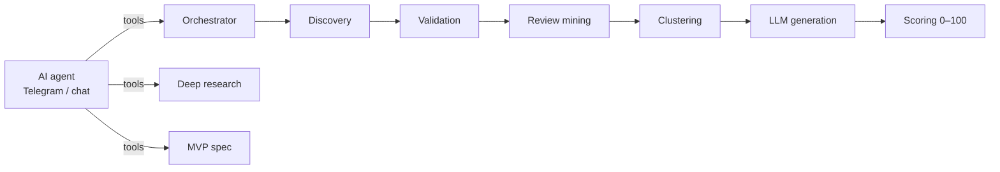

- **12 modular n8n workflows**, webhook API, central error logging
- Versioned prompt library (extraction → clustering → generation → scoring)
- **Stack:** n8n, OpenRouter LLMs, LangChain nodes, PostgreSQL, Telegram

---

## Web & Android

### Polymarket Liquidation Bot — Web · TypeScript
Reads liquidation cascades and open interest on Binance, Bybit and OKX, trades Polymarket Up/Down markets.

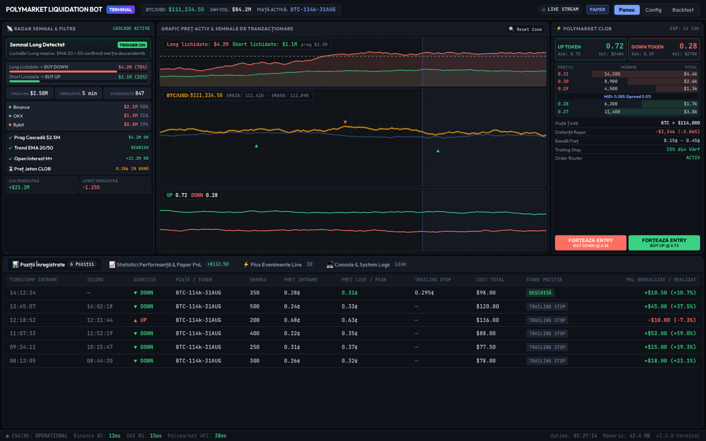

- **Shadow / paper / live** modes; live orders signed with EIP-712
- **Risk:** cooldowns, hourly/daily limits, kill switch, calibration monitor
- **Tests + CI/CD:** GitHub Actions deploys to VPS (Docker Compose, Traefik) on every push
- Live web dashboard (SSE, TradingView charts), HMAC-signed webhooks to n8n

### TheSky — offline controller for a VR headset fleet
Android tablet app that monitors and commands up to ~20 VR headsets on the local network, with no server and no cloud. This is a from-scratch rewrite of an earlier version I wrote by hand, which isn't on GitHub.

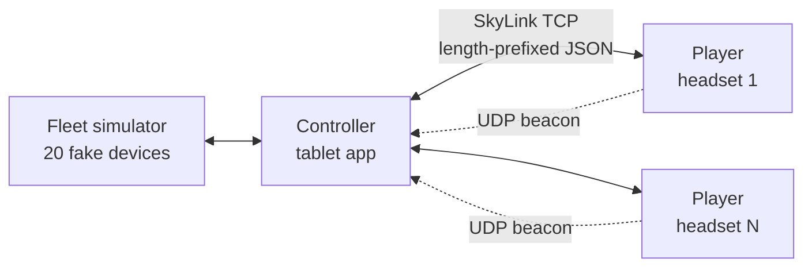

- Own protocol: version handshake, per-command acknowledgements, stable device IDs, devices discovered in ≤2 s
- Clean Architecture + MVI across 19 modules; the fleet simulator runs the real player server code
- Signed daily licences (ECDSA P-256), device binding via Android Keystore, geofenced access
- **Stack:** Kotlin, Jetpack Compose, Coroutines, Ktor sockets, Room, DataStore, Koin, Media3, Firestore rules

### Mine Maker — Minecraft skin editor for Android
An Android app for making Minecraft skins and checking them on a 3D model. It was published on Google Play, up to version 1.12. I wrote all of it myself, without AI tools.

  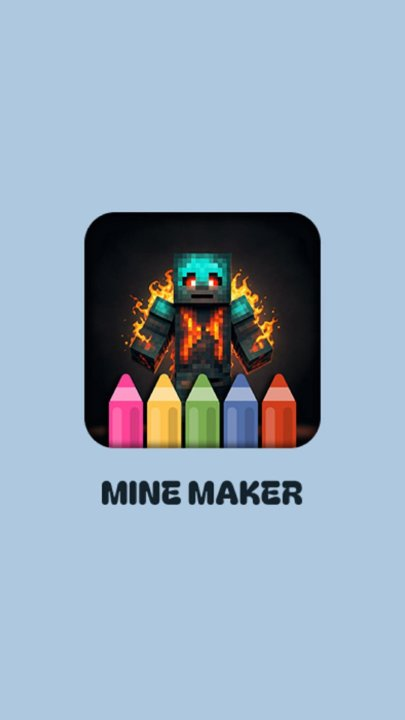
  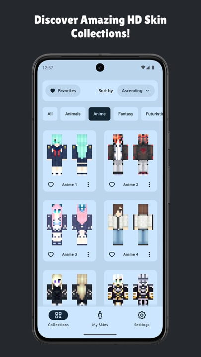
  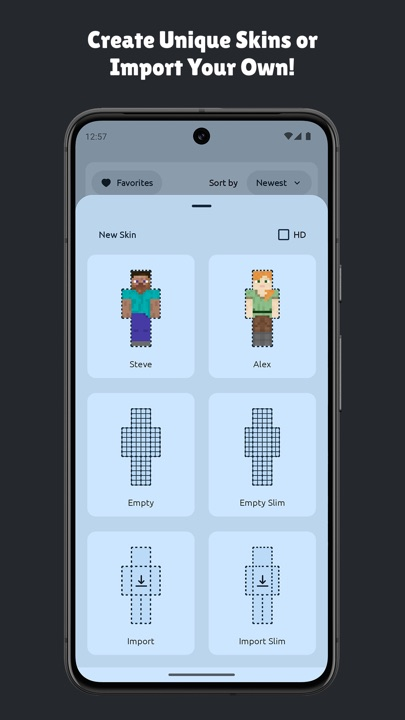
  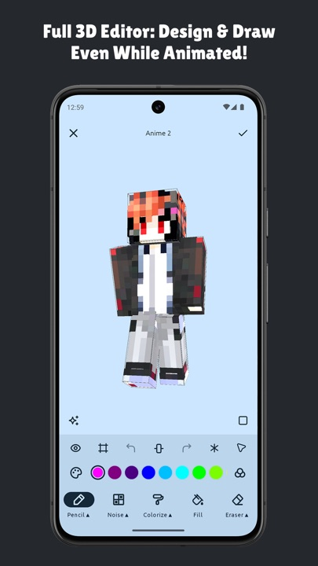
  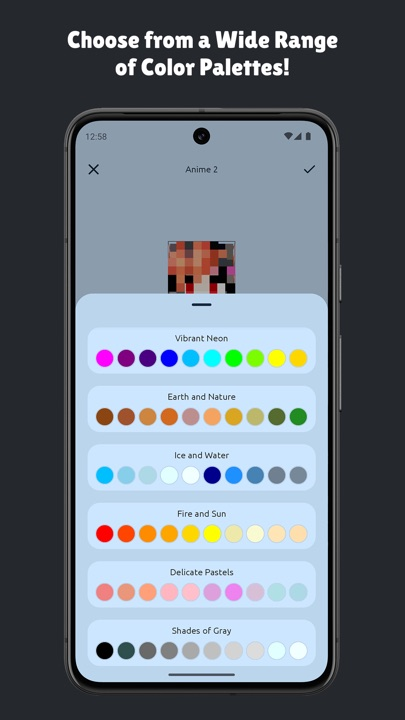

- Skin collections sorted by category, with favourites
- Start from Steve, Alex, an empty template or your own file, in normal or HD size
- Draw straight on the 3D model, even while it's animated: pencil, noise, colorize, fill, eraser, undo/redo, and a button that generates a random skin
- Colour picker and ready-made palettes; skins are saved on the phone and exported so Minecraft can import them
- 12 languages, light and dark theme, installation guide, Premium through Google Play Billing, AdMob ads with UMP consent
- **Stack:** Kotlin, MVVM, Koin, Room, Paging 3, Navigation, Coil, Rajawali (3D), Play Billing, AdMob

### Vista Guard — static site for Google Ads
22-page German site rebuilt from WordPress into a Python-generated static site. €0/month hosting.

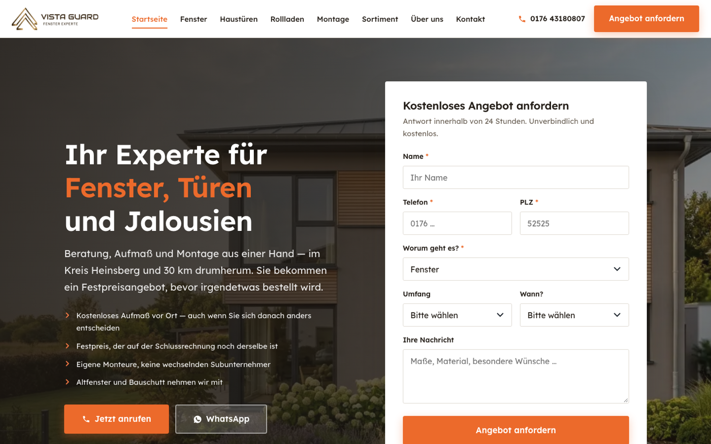

- 4 conversion actions with values, Consent Mode v2, gclid/UTM attribution
- Ads-only landing pages (`noindex`), 6 local SEO pages, GDPR-safe self-hosted fonts
- **Stack:** Python build script, HTML/CSS/JS, Cloudflare Pages
